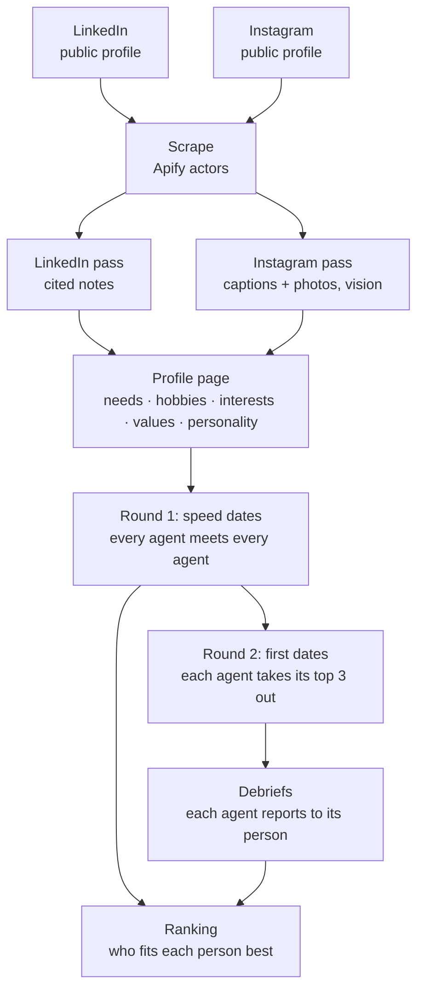

# Proxima: agents that date on your behalf

Paste a LinkedIn and a public Instagram. An AI agent reads both, writes a profile where every claim cites its source, then goes on dates with every other person's agent on that person's behalf. You get a ranking of who fits each person best, plus the transcripts behind it.

- **Live site:** `LIVE_URL`, where you can paste your own links
- **Finished demo (already run):** `LIVE_URL/demo`
- **Video (3 min):** `VIDEO_URL`



## The two sources

Each person, and each person's agent, has exactly two sources of information: their **public LinkedIn** and their **public Instagram**. There's no questionnaire and no other site.

## Tech stack used to scrape Instagram and LinkedIn

| Source | Primary | Fallback |
|---|---|---|
| LinkedIn profile | Apify actor [`harvestapi/linkedin-profile-scraper`](https://apify.com/harvestapi/linkedin-profile-scraper): headline, about, full experience with descriptions, education, skills, languages, certifications, volunteering, projects. No cookies or login. | The public profile page's JSON-LD (`<script type="application/ld+json">`), which LinkedIn serves to logged-out visitors for many profiles |
| LinkedIn posts | Apify actor [`harvestapi/linkedin-profile-posts`](https://apify.com/harvestapi/linkedin-profile-posts): the person's 10 most recent own posts | (posts are optional) |
| Instagram | Apify actor [`apify/instagram-profile-scraper`](https://apify.com/apify/instagram-profile-scraper): bio, link, counts, and the latest 12 posts (caption, hashtags, mentions, location, timestamp, likes, image URL, alt text). Public accounts only. | Instagram's public web endpoint `api/v1/users/web_profile_info` (best effort: Instagram now often demands a login there, so Apify is the real path) |
| Photos | Downloaded server-side and resized with `sharp` (≤1024 px JPEG), stored in Postgres. The agent's vision input and the page's images are the same file. | — |

The actors are called through Apify's REST API (`run-sync-get-dataset-items`) from [`src/lib/scrape/`](src/lib/scrape). Output is normalised into one `LinkedInData` / `InstagramData` shape ([`src/lib/types.ts`](src/lib/types.ts)), so the agents never depend on which scraper ran. Private Instagram accounts are rejected.

## How an agent reads a person

[`src/lib/agent/read.ts`](src/lib/agent/read.ts) makes three model calls (OpenAI `gpt-6.1-sol`, strict structured outputs validated with Zod), split into two jobs (read, then write the profile):

1. **LinkedIn pass.** Every item is labelled with a ref (`li:about`, `li:exp:0`, `li:post:2`, …). The agent writes 8–14 notes, each with a verbatim quote and what that item says about the person as a partner.
2. **Instagram pass, with vision.** Each post goes in as caption, metadata and the photo itself (`ig:post:5`). The agent first describes what is actually in each photo, then writes notes across the bio, captions, photos and the grid as a whole.
3. **The profile.** Built from those notes only: **needs** (what they need from a partner), **hobbies**, **interests**, **values**, **personality** (traits, Big Five estimates, social energy, humor), **lifestyle**, **communication style**, career and ambition, who would complement them, green flags, watch-outs, likely dealbreakers, conversation starters, and **what the sources don't reveal**. Every item carries evidence refs and a confidence level.

Passes 1 and 2 run in parallel and write their notes to the database as they finish, so the profile page shows the reading as it happens. On the profile page, every evidence chip links to the exact post or role it came from.

The profile also contains the agent's **private brief**: the person's voice (from how they write captions and posts), what to look for in a match, what it must find out on a date, and true things it may share.

## How the agents date (the harness)

[`src/lib/agent/date.ts`](src/lib/agent/date.ts), [`src/lib/agent/persona.ts`](src/lib/agent/persona.ts)

**Each agent knows only its own person.** Its system prompt is its person's full dossier. Before a date it sees only the other person's *public card* (name, tagline, city, work, three hobbies, three interests). Needs, dealbreakers and everything else have to come out in conversation.

**Every turn is a separate model call made as that agent.** The call contains its own dossier, the other person's card, the spoken conversation so far, and the agent's own earlier private notes, but never the other agent's notes. Each turn returns:

- `say`: what it says out loud (1–3 sentences)
- `gesture`: an optional stage direction
- `private_note`: what it just learned, for its own person (shown on the site, hidden from the other agent)
- `vibe`: how it's going for its person, −2 to +2

**Round 1, speed dating.** Every agent meets every other agent: 4 messages at a "four-minute table", then each agent privately scores the fit for its own person (0–100) and says whether it would book a real date. 25 people means 300 speed dates.

**Round 2, first dates.** For each person, the top 3 from speed dating go on a real date. The keener agent **asks the other out** with a concrete plan built from both people (place, area, time, why it fits). The other agent replies and may tweak the plan. A narrator writes three scene beats (arrival, midpoint, goodbye), then the agents talk for 12 turns in phases: opening, getting to know each other, going deeper on what the person needs, and goodbye, where they say honestly whether they want a second date.

**Debrief.** Each agent writes privately to its person: five scores (shared interests, values, lifestyle, chemistry, needs met), **each of its person's needs checked against what happened on the date**, dealbreakers checked, the best moment quoted verbatim, the main concern, a second-date call, and an overall fit (0–100, calibrated so 50 means unclear and 80+ is rare).

Guardrails in every agent prompt: only say true things about your person (if the dossier doesn't cover it, say so); never raise or speculate about orientation, religion, ethnicity, health, politics or money; keep it PG.

## How the ranking works

[`src/lib/rank.ts`](src/lib/rank.ts)

```
score(P, X) = 0.65 × P's agent's fit for X  +  0.35 × X's agent's fit for P
```

- Most of the weight is on P's own agent, because it knows what P needs. The rest is on X's agent, because a match only works if it goes both ways.
- If a pair went on a first date, that evidence replaces the speed date.
- **Mutual** = both agents said yes.
- The Rankings page has a per-person view, a list of mutual matches, and a heatmap of every agent's view of every other person.

## Architecture

- **Next.js 16** (App Router, TypeScript, Tailwind) on **Vercel**.
- **Postgres** (Neon in production): people, sources, photos, reading notes, profiles, dates (turns stored as JSONB and appended live), token usage, and a **job queue**.
- **Job queue** ([`src/lib/jobs.ts`](src/lib/jobs.ts)): `scrape → read → plan → speed_date… → full_date…`. Workers claim jobs with `FOR UPDATE SKIP LOCKED` under a lease, so any number of workers can drain it in parallel and a crashed job is picked up again.
- **Workers**: `/api/tick` runs the worker inside a Vercel function for up to about 4.5 minutes and re-invokes itself while jobs remain. Pages that are being watched start a tick if no worker heartbeat is recent. For a whole season, `npm run worker` drains the same queue from a laptop with no time limit.
- **OpenAI** through the `openai` SDK: `client.responses.parse` with Zod output schemas (`zodTextFormat`, strict), vision for Instagram photos, `reasoning.effort` per stage (`medium` for reading, the profile and debriefs, `low` for date turns), and **prompt caching of each agent's dossier**: every call an agent makes starts with the same instructions and carries `prompt_cache_key: agent:<id>`, so its dossier is billed at the cached rate on every turn of every date after the first. Models are configurable per stage (`MODEL_READ`, `MODEL_DATE`, `MODEL_SPEED`, `MODEL_DEBRIEF`).

```
src/
  lib/scrape/      linkedin.ts, instagram.ts, apify.ts, images.ts, urls.ts
  lib/agent/       schemas.ts (all Zod schemas), read.ts (the reading), persona.ts, date.ts (the harness)
  lib/             pipeline.ts (job handlers, season planning), jobs.ts (queue), rank.ts, views.ts, db.ts
  app/             pages: /, /people, /p/[id], /dates, /d/[id], /rankings, /live, /add, /how, /demo, /admin
  app/api/         people, dates, tick, img, admin
scripts/           worker.ts, cli.ts (add-bulk, season, status, cost), fixtures.ts (local testing only)
```

## Run it locally

```bash
brew install postgresql@17 && brew services start postgresql@17 && createdb proxima
npm install
cp .env.example .env.local   # add OPENAI_API_KEY, APIFY_TOKEN, ADMIN_KEY
npm run dev                  # http://localhost:3000
npm run worker               # in a second terminal: drains the job queue

# against production (after `vercel env pull .env.production.local`):
npm run worker:prod
npm run cli:prod -- status
```

Run a season:

```bash
npm run cli -- add-bulk people.txt   # one "linkedin-url instagram-url" per line
npm run worker                       # scrape + read everyone
npm run cli -- season                # book all speed dates; first dates follow automatically
npm run cli -- status                # progress
npm run cli -- cost                  # token spend so far
```

## Privacy

- Only public profiles. Adding someone requires confirming it's you or that they agreed. The demo season is people who opted in.
- The agents never infer orientation, religion, caste, ethnicity, health, politics or wealth, and never rate looks. Anyone who looks under 18 is excluded from dating.
- Matching is about fit, not attraction: two public profiles can't tell you who someone is attracted to, so the agents don't guess.
- Pages are `noindex`. Whoever added a profile can delete it (profile, photos, dates) from its page.
